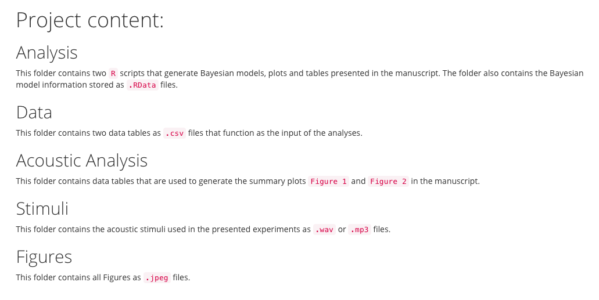
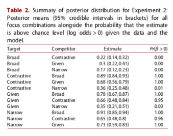
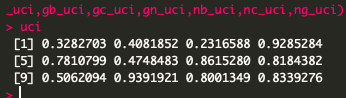
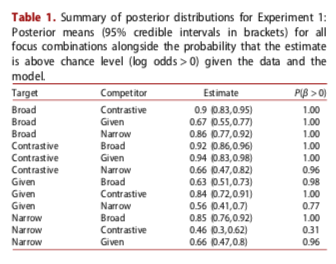
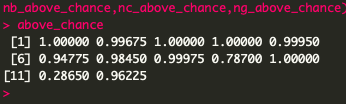
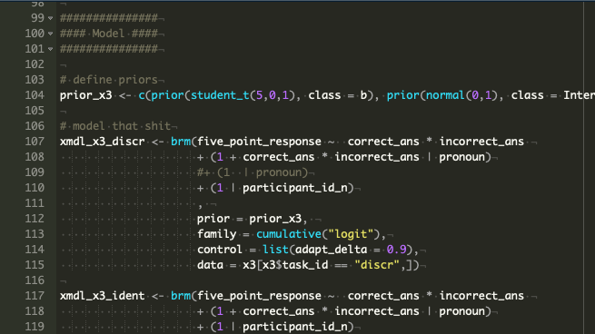

# Content

1. Goal of the study

--

2. Methodology
--

3. Material and resource availability

--
 
4. Supplementary materials
--

5. Analysis:

    - Software
    - Running the code
--

6. Other materials
--

7. Conclusion

---

# 1. Goal of the study

 

???

The research so far is lacking empirical evidence for the relationship between the prosodic signal and information structure as perceived by a listener. This study aimed at finding out

--

### .center[**To what extent can prosodic form-function relationships   be detected on the basis of prosodic cues?**]

???

The relationships they focus on are Givenness and Focus distinctions, as prosody is very important in distinguishing them, especially in West Germanic languages (Büring, 2006; Ladd, 2008; Rooth, 1992; Selkirk, 1995). In particular, the two research questions guiding this study were

--

 
 
 
 

"(i) How well listeners can identify the focus condition of an utterance based on its prosodic form (form-to-function mapping)"

--

"(ii) How well they can identify an appropriate prosodic form to match the focus condition specified by the discourse context (function-to-form mapping)"

---

# 2. Methods

## Participants

- Recruited online

- From the United States 

- +18 years old

- Only one participation

???
via the crowd-sourcing website Amazon Mechanical Turk (AMT).

[findparticipants
prolific.ac]

via filtering of IP address by the AMT system

xx

from 3 experiments 

---

# 2. Methods

## Materials & Procedure

 

|(1) Damon fried the omelet.   |
|:-------|:------|
| a. Do you know what happened yesterday? | [Damon fried the omelet]F. |
| b. Do you know who fried the omelet? | [Damon]F fried the omelet. |
| c. Do you know what Damon fried? | Damon fried [the omelet]F. |
| d. Did Pam fry the omelet? | [Damon]F fried the omelet. |
| e. Did Damon fry the omelet? | Damon fried the omelet. |

 

- Two-alternative forced-choice response (experiments 1 and 2)
- 5-point scale response (experiment 3)

???

Between-subjects
Reaction to short question-answer dialogues.

The question provides the discourse context that establishes one of four information structure conditions of the answer: broad focus (a), narrow focus (b-c), and contrastive focus (d) on the sentential subject, and the sentence subject as discourse-given (e).

For experiments 1 & 2
Two tasks (between-subjects, only one pair)
  1. listeners had to select which of two prosodic patterns best signalled a specified focus category (1 context – 2 prosodic forms, henceforth 1C-2P)
  2. listeners had to select which of two focus categories was signalled by the prosody of an utterance (2 contexts – 1 prosodic form, henceforth 2C-1P).

---

# 2. Methods

## Statistical Analysis

Bayesian statistics
  - Hierarchy logistic regression models (Exp. 1 & 2)
  - Hierarchical ordinal logistic models (Exp. 3)
      - Random intercept for participants

---

# 3. Material and resource availability

https://osf.io/4qxmh/

Data  
Code
      Abstract
      Wiki for project content  

      
--
NO reproducible document:
  - No registration
  - No README
  
???

  

---
 
# 4. Supplementary materials

https://osf.io/4qxmh/

Stimuli   
Figures (reproduced)

--

No README file, no codebook for supplementary materials either

---

# 5. Analysis:

##  Software

R > brms (Bürkner, 2016)
   
???
So open source

--
      
##  Running the code

No errors (if everything run)   

No output   
Poor informative comments in code (except at beginning)
No print command to see actual results
>
Results confusing: same names for code variables in both experiments        
Decimals sometimes truncated sometimes rounded up or down   
Exp 3 outputs many more numbers than reported: criteria for exclusion?

      
???
If run from the created data files, then experiment 1 throws error for one command

Two figures have their own code, four others embedded in analysis code, and not all numbers are rounded equal (some up after .5, some down even if higher than .5)

If you run all the code, and print, it will retrieve results for exp 2 

---
##### See higher bound for estimate, numbers sometimes truncated, other rounded

---

# 5. Analysis

Results reproduced mostly   
But, for experiment 1 (table 1), beta not always

--

##### See P beta > 0 column, data not always reproduced

---
# 6. Other materials

Two RData files

???
generated by code anyway, but appreciated as it takes forever to produce them

---

# 7. Conclusion

Score: 5/10

--

Reasons:  

  - Stimuli provided
  - Working code provided

--
 

  - No pre-registration
  - No README
  - No reproducible document
  - Poor comments and name assignment in code resulting in confusing reproducible results
  - Data sometimes manipulated?
  - Directory had to be changed to reproduce figures 1 & 2

???

To see changes in real time

remotes::install_github('yihui/xaringan', upgrade = TRUE)
xaringan::inf_mr()  # delay is one second

---

???
We all feel frustrated: Model that shit

---
 
 
 
 
 
 
 
 

# Thank you
